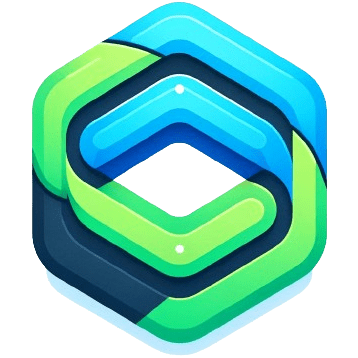

<p align="center"></p>

# Domy

A lightweight and minimal JavaScript framework for your frontend that mixes AlpineJS and VueJS perfectly.

# 🚀 Features

- Lightweight and fast
- Reactive data binding
- Component-based architecture
- Easy to integrate with existing projects
- No virtual DOM

# 📚 Documentation

Check out the [official documentation](https://domyjs.github.io/domy/) for detailed instructions on how to get started with Domy.

# Installation

```
$ npm install @domyjs/core
```

or with the cdn

```html
<script src="https://unpkg.com/@domyjs/core"></script>
```

# 📝 Usage

Here’s a quick example to get you started:

```html
<div d-scope="{ count: 0 }">
  <p>Count: {{ count }}</p>
  <button @click="count++">Increment</button>
</div>
```

```html
<script>
  DOMY.createApp().mount();
</script>
```

# 📄 Changelog

Check the [Changelog](./CHANGELOG.md) to see what's new in each version.

# 🤝 Contributing

We welcome contributions of all kinds! Check out our [Contributing Guide](./CONTRIBUTE.md) for details on how to get started.

# 👮‍♂️ Code of conduct

Check out our [CODE OF CONDUCT](./CODE_OF_CONDUCT.md) for details.

# 💎 Contact

If you have any questions or feedback, feel free to open an issue.

# 💜 License

This project is licensed under the MIT License - see the [LICENSE](./LICENSE) file for details.
