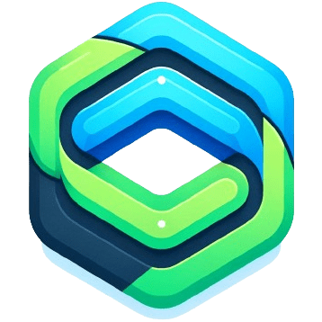

<p align="center"></p>

# Domy

A lightweight and minimal JavaScript framework for your frontend that mixes AlpineJS and VueJS perfectly.

# 🚀 Features

- Lightweight and fast
- Reactive data binding
- Component-based architecture
- Easy to integrate with existing projects
- No virtual DOM

# 📚 Documentation

Check out the [official documentation](https://domyjs.github.io/domy/) for detailed instructions on how to get started with Domy.

# Installation

```
$ npm install @domyjs/domy
```

or with the cdn

```html
<script src="https://unpkg.com/@domyjs/domy@1.x.x"></script>
```

# 📝 Usage

Here’s a quick example to get you started:

```html
<html>
  <head>
    <title>My Counter!</title>
    <script src="https://unpkg.com/@domyjs/domy@1.x.x"></script>
  </head>

  <body>
    <div d-scope="{ count: 0 }">
      <p>Count: {{ count }}</p>
      <button @click="count++">Increment</button>
    </div>
  </body>

  <script>
    DOMY.createApp().mount();
  </script>
</html>
```
